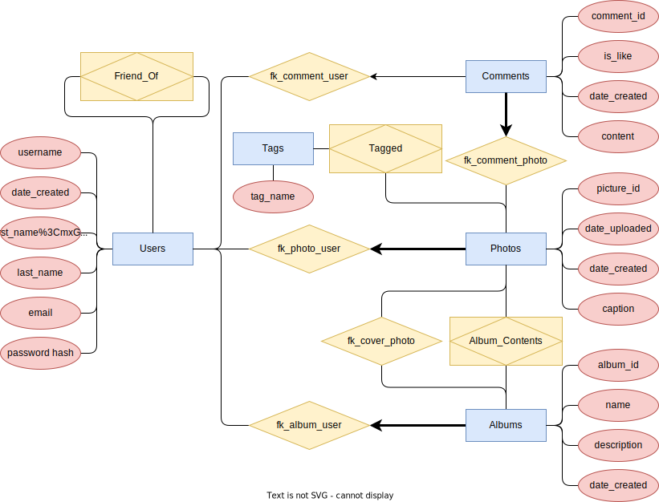

# Photo Sharing App

## Description

This app is a fully featured photo sharing app, where you can create a profile, upload photos, add friends, and like and comment on content. It uses a MySQL database, using Flask as the backend framework. For APIs, this app uses React.JS requests (which are Express requests).

## Setup Steps

1. `cd backend && pip install requirements.txt`
2. `cd ../frontend && yarn install`
3. `yarn run start`
4. In a new terminal: `cd frontend && yarn run start-api`

## Database Design

### Assumptions

1. Each user can have none or any number of albums
2. Each user can have none or any number of friends
3. Every album can contain none or any number of photos
4. Each photo can only be in one album
5. Each photo can have none or any number of tags
6. Multiple photos can be tagged with the same tag
7. Comments can be published without being associated with a user

### ER Model

